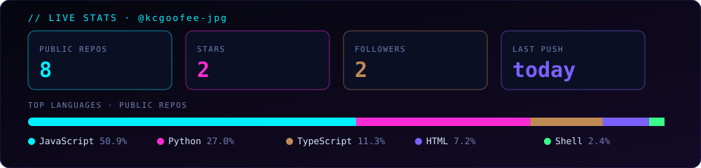

  
  
  

**I build small, sharp tools that make [SillyTavern](https://github.com/SillyTavern/SillyTavern) chats better — a proxy, a map layer, and the glue in between.**

## ⚡ Featured

<table>
  <tr>
    <td width="50%" valign="top">
      <h3><a href="https://github.com/kcgoofee-jpg/CCST">CCST</a></h3>
      
Chat in SillyTavern with your own Claude subscription: a cache-aware proxy, lost-reply recovery and a one-click install.

      

        
        
        
      

      
<a href="https://github.com/kcgoofee-jpg/CCST#readme">Install in 5 minutes →</a>

    </td>
    <td width="50%" valign="top">
      <h3><a href="https://github.com/kcgoofee-jpg/my-tavern-experiments">Eden Map</a></h3>
      
A map layer that follows the story: where the scene is, who stands where, what just happened. Becoming a card-agnostic <b>Spatial OS</b> — an engine plus data packs.

      

        
        
        
        
      

      
<a href="https://github.com/kcgoofee-jpg/my-tavern-experiments#install">Add it as a TavernHelper script →</a>

    </td>
  </tr>
</table>

## 🧰 Stack

  
  
  
  
  
  
  
  

## 📊 Live stats

  

## 🐍 Contribution snake

  <picture>
    <source media="(prefers-color-scheme: dark)" srcset="https://raw.githubusercontent.com/kcgoofee-jpg/kcgoofee-jpg/output/snake-dark.svg">
    
  </picture>

